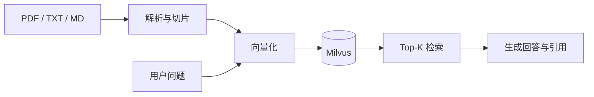

# 智阅 RAG：本地文献知识库智能检索系统

毕业实习项目：**基于 Spring Boot 与 Milvus 的本地知识库文献智能检索系统设计与实现**。

系统支持批量导入 PDF、TXT 和 Markdown 文献，自动完成文本解析、切片、向量化与 Milvus 入库，并通过 RAG 流程生成带原文依据的回答。默认模式不需要 API Key，适合开箱演示；也可以通过环境变量接入 OpenAI 兼容的嵌入与对话接口。

## 功能

- 批量文献上传与格式校验
- PDF 文本解析和滑动窗口切片
- Milvus 向量集合自动初始化、写入、检索和删除
- RAG 智能问答与相似度排序
- 回答来源、原文片段和文献下载
- 文献状态、统计工作台和问答历史
- 本地零密钥模式 / OpenAI 兼容模型模式
- H2 本地持久化、Docker 一键启动、GitHub Actions 自动测试
- 响应式中文界面，适配电脑和手机

## 系统结构



| 层次 | 技术 |
|---|---|
| 前端 | HTML5、CSS3、原生 JavaScript |
| 后端 | Java 17、Spring Boot 3.5.16、Spring MVC |
| 元数据 | Spring Data JPA、H2 2.x |
| 文档解析 | Apache PDFBox 3.0.8 |
| 向量数据库 | Milvus 3.0.1、Milvus Java SDK 3.0.5 |
| 部署测试 | Docker Compose、Maven、GitHub Actions |

## 最快启动方式

前提：安装并启动 Docker Desktop（Windows 建议启用 WSL 2 后端）。

```bash
docker compose up --build -d
```

首次启动需要下载镜像并构建应用，等待 Milvus 健康检查通过后访问：

- 系统首页：<http://localhost:8080>
- Milvus WebUI：<http://localhost:9091/webui/>
- 健康检查：<http://localhost:8080/actuator/health>

停止服务：

```bash
docker compose down
```

文献、元数据和 Milvus 数据分别保存在 `uploads/`、`data/` 和 `volumes/`，停止容器不会删除数据。

## 不使用 Docker 运行应用

需要 Java 17、Maven 3.6.3+，以及运行在 `localhost:19530` 的 Milvus。

```bash
mvn spring-boot:run
```

只想快速体验界面与问答流程，可以临时使用内存向量库：

```bash
APP_VECTOR_STORE=memory mvn spring-boot:run
```

Windows PowerShell：

```powershell
$env:APP_VECTOR_STORE="memory"
mvn spring-boot:run
```

内存模式重启后会丢失向量，仅用于开发；正式演示应使用 Milvus。

## 接入真实大模型

默认配置采用本地特征向量与检索摘要，完全不需要密钥，能够演示完整的数据流。要获得语义更强的检索和归纳回答，将 `.env.example` 复制为 `.env`：

```env
APP_EMBEDDING_PROVIDER=openai
APP_CHAT_PROVIDER=openai
AI_BASE_URL=https://api.openai.com/v1
AI_API_KEY=替换为自己的密钥
AI_EMBEDDING_MODEL=text-embedding-3-small
AI_CHAT_MODEL=gpt-4.1-mini
AI_EMBEDDING_DIMENSION=384
```

然后重新启动：

```bash
docker compose up --build -d
```

接口提供方需要兼容 `/embeddings` 和 `/chat/completions`。`AI_EMBEDDING_DIMENSION` 必须与嵌入模型输出一致。修改维度后，应更改 `APP_MILVUS_COLLECTION`，或先备份资料并清理旧的 Milvus 数据后重建。

## API

| 方法 | 路径 | 说明 |
|---|---|---|
| GET | `/api/status` | 获取向量库和模型状态 |
| GET | `/api/dashboard` | 获取系统统计 |
| GET | `/api/documents` | 查询文献列表 |
| POST | `/api/documents` | 批量上传文献，字段名 `files` |
| GET | `/api/documents/{id}/download` | 下载原始文献 |
| DELETE | `/api/documents/{id}` | 删除文献及向量 |
| POST | `/api/chat` | 提问，JSON：`{"question":"..."}` |
| GET | `/api/history` | 查询问答历史 |
| DELETE | `/api/history` | 清空问答历史 |

## 项目目录

```text
src/main/java/cn/edu/rag
├── config       配置映射
├── domain       JPA 实体
├── dto          API 数据结构
├── repository   元数据访问
├── service      解析、切片、向量、RAG 核心逻辑
└── web          REST 接口和异常处理

src/main/resources/static
├── css          响应式样式
├── js           页面交互与接口调用
└── index.html   单页应用入口
```

更多材料：

- [系统设计说明](docs/系统设计说明.md)
- [实习报告写作提纲](docs/实习报告写作提纲.md)
- [演示用示例资料](samples/课程资料示例.txt)

## 测试

```bash
mvn verify
```

测试覆盖文本切片、零密钥向量、文本解析以及“上传 → 检索 → 回答 → 统计”主流程。代码推送和 Pull Request 会自动运行 GitHub Actions。

## 常见问题

### 页面显示“向量服务未连接”

运行 `docker compose ps`，确认 `xiangmu1-milvus` 为 healthy。Milvus 首次启动通常比 Web 应用慢。

### PDF 导入后显示失败

扫描图片型 PDF 没有文字层，需要先 OCR；加密或损坏的 PDF 也可能无法解析。可先用 `samples/课程资料示例.txt` 验证完整流程。

### 修改模型后检索报维度错误

Milvus 集合的向量维度在创建时固定。请恢复原维度，或使用新的 `APP_MILVUS_COLLECTION` 集合名重新导入资料。

### 国内网络拉取镜像较慢

先在 Docker Desktop 中配置可用的镜像源，再重新执行 `docker compose up --build -d`。
