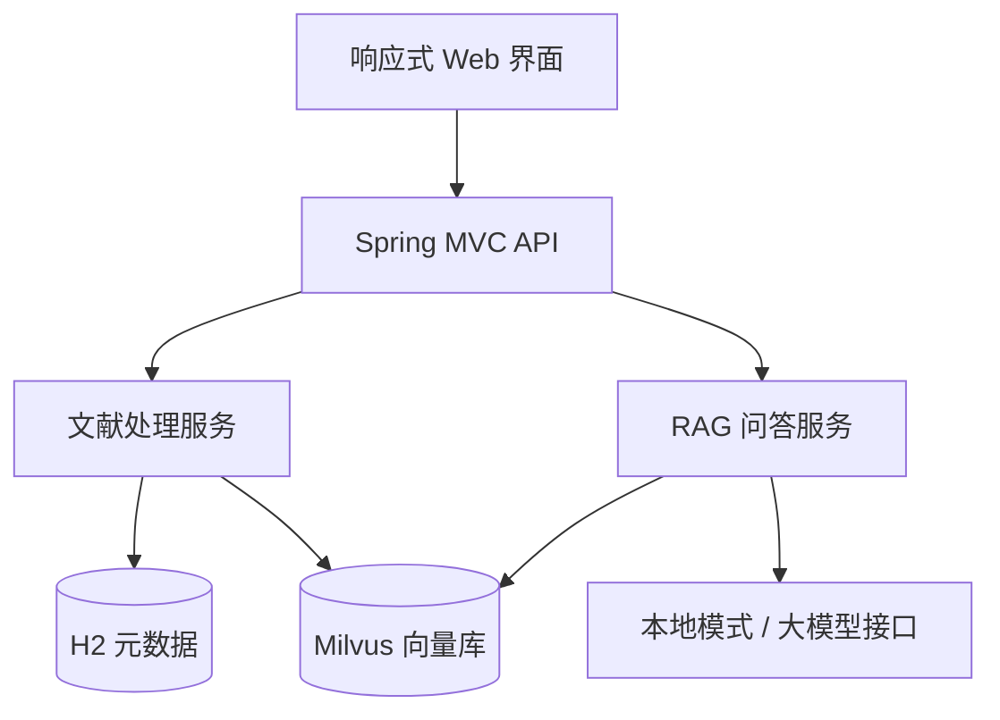
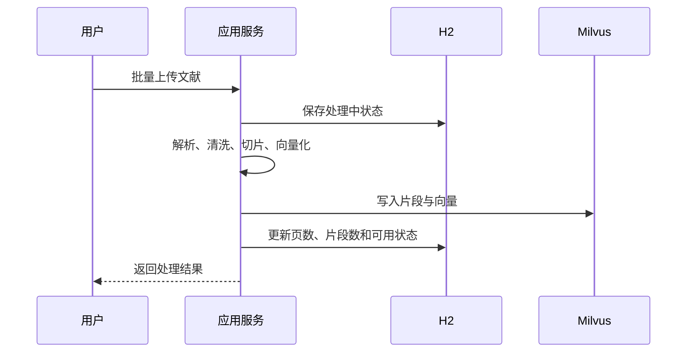
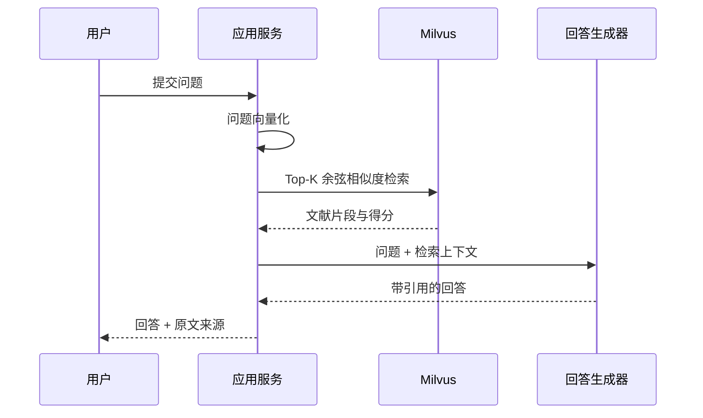

# 系统设计说明

## 1. 项目目标

构建一个面向个人文献资料的本地知识库。用户无需逐篇查找，即可上传资料并使用自然语言检索；系统返回归纳答案，同时展示命中文献、片段序号、相似度和原文，降低大模型无依据回答的风险。

## 2. 需求范围

### 核心需求

1. 支持一次上传多份 PDF、TXT、Markdown 文献。
2. 对文件类型、数量和大小进行校验。
3. 自动解析文本，以带重叠的窗口进行知识切片。
4. 将文献片段转换为定长向量并存入 Milvus。
5. 将用户问题向量化，完成 Top-K 相似度检索。
6. 基于检索片段生成回答并展示来源。
7. 管理文献原文件、处理状态和问答历史。

### 非目标

- 当前版本不处理扫描图片型 PDF 的 OCR。
- 当前版本面向单用户本地使用，不实现复杂组织权限。
- 当前版本不训练或微调大语言模型。

## 3. 总体架构

系统采用单体分层架构。它比微服务更适合四周实习项目：部署简单、代码边界明确，同时能够完整体现控制层、业务层、数据层和外部服务集成。

## 4. 核心流程

### 文献入库

### RAG 问答

## 5. 数据设计

### H2：knowledge_documents

| 字段 | 含义 |
|---|---|
| id | 文献编号 |
| original_name | 原始文件名 |
| storage_name | 随机存储名，避免覆盖和路径注入 |
| content_type / size_bytes | 文件类型与大小 |
| page_count / chunk_count | 页数与片段数 |
| status | PROCESSING、READY、FAILED |
| error_message | 失败原因 |
| created_at / processed_at | 上传与处理时间 |

### H2：query_history

| 字段 | 含义 |
|---|---|
| id | 记录编号 |
| question / answer | 问题与回答 |
| source_count | 命中来源数 |
| duration_ms | 处理耗时 |
| created_at | 提问时间 |

### Milvus：literature_chunks

| 字段 | 类型 | 含义 |
|---|---|---|
| chunk_id | VarChar，主键 | `{文献编号}-{片段序号}` |
| document_id | Int64 | 关联 H2 文献编号 |
| chunk_index | Int64 | 片段序号 |
| title | VarChar | 文献标题 |
| content | VarChar | 片段原文 |
| embedding | FloatVector | 向量，默认 384 维 |

向量字段使用 AUTOINDEX 和 COSINE，兼顾配置简洁与检索效果。

## 6. 关键设计选择

- **滑动窗口切片**：片段间保留重叠文本，减少语义在边界处被截断。
- **存储名随机化**：原文件名只作为展示元数据，磁盘路径使用 UUID。
- **来源可追溯**：回答和检索结果同时返回，用户可以核对原文。
- **模型接口解耦**：`EmbeddingProvider`、`ChatProvider` 和 `VectorStore` 都是接口，可替换实现。
- **可降级演示**：没有 API Key 时仍能完成本地向量检索和摘要，不因第三方额度影响答辩。
- **安全输出**：前端通过 `textContent` 展示回答和文献内容，避免把文献中的 HTML 当作页面执行。

## 7. 测试方案

| 编号 | 测试项 | 预期结果 |
|---|---|---|
| T01 | 上传 TXT | 状态 READY，片段数大于 0 |
| T02 | 上传含文字 PDF | 正确提取文本与页数 |
| T03 | 上传不支持格式 | 返回 400 和明确提示 |
| T04 | 空文件 | 拒绝上传 |
| T05 | 文献相关提问 | 返回回答、来源和耗时 |
| T06 | 删除文献 | H2、原文件和 Milvus 向量同步删除 |
| T07 | 移动端访问 | 菜单、列表和问答布局正常 |
| T08 | Milvus 停止 | 页面显示未连接，不误报正常 |

## 8. 后续扩展

OCR、DOCX 解析、用户与角色权限、混合检索、重排序、流式回答、文献标签、批量异步任务和 MySQL 可作为后续迭代方向。
